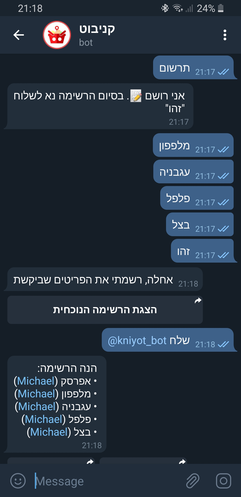

# Knibot
### A (hebrew-speaking) shared grocery lists management telegram bot
Knibot can help you create and manage shopping lists, and share them with frinds & family!

### Where can it be found?
In telegram, look for `קניבוט` or `kniyot_bot`. Knibot will then provide help on how to create and share lists.

---

_A screenshot of a Knibot chat_

---

_Knibot is developed in python 3 using flask as a web framework, and a PostgreSQL database. Knibot is deployed on Heroku._
